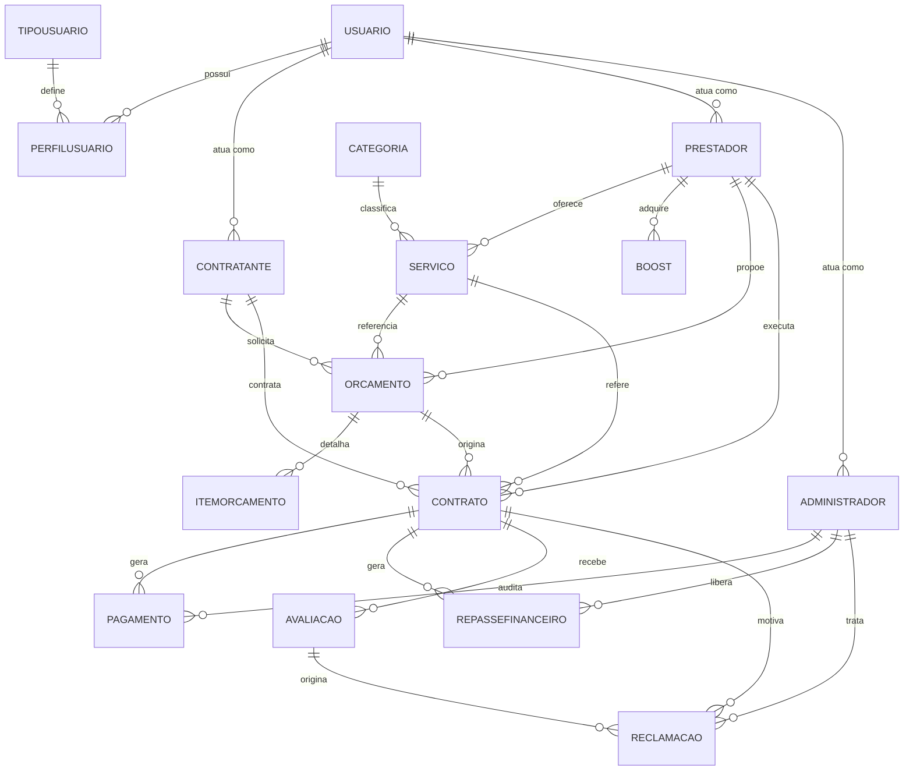

<div align="center">

# 🔗 Conecta Service

**Sistema de Prestação e Contratação de Serviços**

Plataforma digital que conecta profissionais autônomos a clientes de forma simples, rápida e segura.


*Projeto Integrador — Fatec Jales · Tecnologia em Análise e Desenvolvimento de Sistemas (ADS-AMS)*

</div>

---

## 📑 Sumário

- [Sobre o projeto](#-sobre-o-projeto)
- [Problema e motivação](#-problema-e-motivação)
- [Objetivos](#-objetivos)
- [Funcionalidades](#-funcionalidades)
- [Requisitos não funcionais](#-requisitos-não-funcionais)
- [Atores do sistema](#-atores-do-sistema)
- [Modelagem](#-modelagem)
- [Banco de dados](#-banco-de-dados)
- [Tecnologias](#-tecnologias)
- [Como executar](#-como-executar)
- [Estrutura da documentação](#-estrutura-da-documentação)
- [Equipe](#-equipe)
- [Referências](#-referências)

---

## 📖 Sobre o projeto

O **Conecta Service** é uma plataforma digital de intermediação de serviços que aproxima **prestadores autônomos** e **contratantes** em um ambiente estruturado, transparente e seguro.

O sistema permite o cadastro de prestadores, a busca de serviços por categoria e localização, a solicitação de orçamentos, a intermediação de pagamentos e a avaliação dos serviços realizados, trazendo mais visibilidade para quem oferece o serviço e mais confiança para quem contrata.

---

## 🎯 Problema e motivação

A contratação de profissionais autônomos ainda ocorre, em grande parte, de maneira **informal**, por indicações pessoais ("boca a boca") e redes sociais. Isso gera problemas como:

- **Baixa visibilidade** dos profissionais, restritos a pequenas regiões;
- **Assimetria de informação**: o contratante não tem histórico, avaliações ou portfólio para comparar prestadores;
- **Insegurança nas transações**, com pagamentos combinados diretamente entre as partes, sem contrato formal;
- **Falta de padronização** e de registro estruturado das etapas de contratação, execução e finalização;
- **Comunicação desorganizada**, feita por aplicativos de mensagens, sem acompanhamento do serviço.

O Conecta Service propõe uma solução centralizada para reduzir essas limitações e contribuir para a profissionalização do setor.

---

## 🚀 Objetivos

- Ampliar a **visibilidade** de profissionais autônomos;
- Facilitar a **busca e a contratação** de serviços por categoria e localização;
- Aumentar a **confiança** por meio de avaliações baseadas na experiência dos usuários;
- Garantir **segurança financeira** com intermediação de pagamentos e repasse ao prestador após a conclusão do serviço;
- Oferecer **controle e suporte** por meio de um perfil administrativo, com tratamento de reclamações.

---

## ✨ Funcionalidades

### Gerais
- Cadastro de usuário com definição de tipo (contratante ou prestador) e validação de confirmação de senha
- Login e logout
- Visualização e edição de perfil
- Exclusão de conta
- Alternância entre tema claro e escuro

### Prestador
- Cadastro, edição e exclusão de serviços
- Visualização de calendário/agenda
- Histórico de pagamentos recebidos
- Consulta de clientes
- **Boost**: destaque do perfil nas listagens mediante pagamento

### Contratante
- Busca de serviços por nome ou especialização
- Filtro por estado e cidade
- Listagem e visualização do perfil detalhado dos prestadores
- Solicitação de orçamento e contratação de serviço
- Pagamento intermediado pela plataforma
- Cancelamento de serviço
- Avaliação do serviço prestado
- Histórico de prestadores contratados (para recontratação)

### Administrador
- Listagem de pendências
- Visualização e tratamento de reclamações
- Liberação de pagamentos (repasse ao prestador)
- Acesso ao suporte

<details>
<summary><strong>📋 Lista completa de requisitos funcionais</strong></summary>

| Código | Requisito | Descrição |
|--------|-----------|-----------|
| RF01 | Cadastro de usuário | Cadastro com definição do tipo (contratante ou prestador) |
| RF02 | Confirmação de senha | Validação da confirmação de senha no cadastro |
| RF03 | Login de usuário | Login para contratantes e prestadores |
| RF04 | Logout de usuário | Encerramento da sessão |
| RF05 | Exclusão de conta | Exclusão de conta por contratantes e prestadores |
| RF06 | Cadastro de serviços | Prestadores cadastram e publicam seus serviços |
| RF07 | Edição de serviços | Prestadores editam serviços publicados |
| RF08 | Exclusão de serviços | Prestadores removem serviços publicados |
| RF09 | Visualização de perfil | Visualização de perfis próprios e de outros usuários |
| RF10 | Busca de serviços | Busca por nome ou especialização |
| RF11 | Filtro por localização | Filtragem por estado e cidade |
| RF12 | Listagem de prestadores | Exibição de prestadores conforme os filtros aplicados |
| RF13 | Avaliação de serviços | Contratantes avaliam serviços prestados |
| RF14 | Intermediação de pagamento | Pagamentos intermediados entre contratante e prestador |
| RF15 | Histórico de serviços | Armazenamento do histórico de serviços realizados |
| RF16 | Gerenciamento de perfil | Edição de dados cadastrais |
| RF17 | Contratação de serviço | Contratantes solicitam serviços pelo perfil do prestador |
| RF18 | Cancelamento de serviço | Cancelamento de serviços contratados |
| RF19 | Sistema de boost | Prestadores adquirem destaque mediante pagamento |
| RF20 | Alteração de tema | Alternância entre tema claro e escuro |

</details>

---

## 🛡️ Requisitos não funcionais

| Código | Requisito | Descrição |
|--------|-----------|-----------|
| RNF01 | Desempenho | Tempo de resposta rápido |
| RNF02 | Segurança | Proteção dos dados dos usuários |
| RNF03 | Usabilidade | Interface intuitiva |
| RNF04 | Disponibilidade | Disponível 24 horas por dia |
| RNF05 | Compatibilidade | Funcionamento em dispositivos mobile |
| RNF06 | Confiabilidade | Operação estável |
| RNF07 | Escalabilidade | Suporte ao crescimento de usuários |
| RNF08 | Manutenibilidade | Facilidade de manutenção |
| RNF09 | Segurança de pagamento | Transações seguras |
| RNF10 | Privacidade | Proteção das informações |

---

## 👥 Atores do sistema

| Ator | Descrição |
|------|-----------|
| **Usuário** | Ator geral que engloba todos os perfis da plataforma |
| **Administrador** | Gerencia o sistema, trata reclamações, audita e libera pagamentos |
| **Prestador** | Divulga e oferece serviços, gerencia agenda, recebe pagamentos e pode ativar o Boost |
| **Contratante** | Busca prestadores, solicita orçamentos, paga e avalia os serviços |
| **Sistema Mobile** | Representa a camada de lógica de negócio e automação da plataforma |

---

## 🧩 Modelagem

O sistema foi modelado em UML. As classes principais são:

| Domínio | Classes |
|---------|---------|
| **Usuários e perfis** | `Usuario`, `TipoUsuario`, `PerfilUsuario`, `Prestador`, `Contratante`, `Administrador` |
| **Catálogo de serviços** | `Categoria`, `Servico` |
| **Negociação e contratação** | `Orcamento`, `ItemOrcamento`, `Contrato` |
| **Financeiro** | `Pagamento`, `RepasseFinanceiro`, `Boost` |
| **Pós-serviço** | `Avaliacao`, `Reclamacao` |

### Fluxo principal de uso

```
Cadastro/Login → Busca de prestadores → Solicitação de orçamento → Contrato
      → Pagamento (intermediado) → Conclusão do serviço → Repasse ao prestador → Avaliação
```

> Os diagramas completos (classes, atores e casos de uso geral e individuais) estão na documentação do projeto.

---

## 🗄️ Banco de dados

O banco de dados é relacional, implementado em **PostgreSQL** e administrado com o **pgAdmin**. O PostgreSQL garante as propriedades **ACID** (atomicidade, consistência, isolamento e durabilidade), essenciais para operações de contratação e pagamento.

### Modelo de relacionamento (resumo)



### Tabelas

`Usuario` · `TipoUsuario` · `PerfilUsuario` · `Contratante` · `Prestador` · `Administrador` · `Categoria` · `Servico` · `Orcamento` · `ItemOrcamento` · `Contrato` · `Pagamento` · `RepasseFinanceiro` · `Boost` · `Avaliacao` · `Reclamacao`

<details>
<summary><strong>Exemplo de script: tabela <code>Usuario</code></strong></summary>

```sql
CREATE TABLE Usuario (
    idUsuario    SERIAL PRIMARY KEY,
    nome         VARCHAR(150),
    email        VARCHAR(150),
    senha        VARCHAR(255),
    telefone     VARCHAR(20),
    cpf          VARCHAR(14),
    fotoPerfil   TEXT,
    cidade       VARCHAR(100),
    estado       VARCHAR(50),
    dataCadastro DATE,
    statusConta  VARCHAR(50)
);
```

</details>

---

## 🛠️ Tecnologias

| Camada | Tecnologia |
|--------|-----------|
| Aplicativo | [Expo](https://expo.dev/) (Snack) |
| Linguagem | JavaScript |
| Banco de dados | PostgreSQL |
| Administração do banco | pgAdmin |
| Persistência | ORM com migrações |
| Modelagem | UML |
| Controle de versão | Git e GitHub |

---

## ▶️ Como executar

> ⚠️ Ajuste esta seção conforme a estrutura final do projeto.

```bash
# 1. Clone o repositório
git clone https://github.com/guilhermezanardi07/conecta-service.git

# 2. Acesse a pasta do projeto
cd conecta-service

# 3. Instale as dependências
npm install

# 4. Inicie o projeto com o Expo
npx expo start
```

**Banco de dados:** crie um banco PostgreSQL e execute os scripts de criação das tabelas (disponíveis na documentação) pelo pgAdmin ou pelo `psql`.

---

## 📚 Estrutura da documentação

A documentação completa do projeto contempla:

1. Introdução
2. Levantamento de requisitos de software
3. Visão de caso de uso (UML): diagrama de classes, dicionário de classes, atores, casos de uso
4. Definição da interface com o usuário (UX)
5. Banco de dados: modelo E-R, scripts das tabelas e mapeamento objeto-relacional
6. Arquitetura de software
7. Conclusão
8. Referências

---

## 👨‍💻 Equipe

| Nome |
|------|
| Arthur Francisco Mendonça Lima |
| Bruno Seleguim dos Santos |
| Guilherme Zanardi Visoná |
| Matheus Henrique Bernardes de Oliveira |
| Rafael Dias de Melo |

**Orientador:** Prof. Jeferson

**Instituição:** Faculdade de Tecnologia Professor José Camargo — Fatec Jales

---

## 📎 Referências

- SOMMERVILLE, Ian. *Engenharia de Software*. 10. ed. São Paulo: Pearson, 2018.
- GUEDES, Gilleanes T. A. *UML 2: uma abordagem prática*. 3. ed. 2018.
- SILBERSCHATZ, Abraham; KORTH, Henry F.; SUDARSHAN, S. *Sistema de Banco de Dados*. 6. ed. Rio de Janeiro: Elsevier, 2012.
- MACHADO, Felipe N. R. *Banco de Dados: Projeto e Implementação*. 4. ed. São Paulo: Érica, 2020.
- ANICHE, Maurício. *Orientação a Objetos e SOLID para Ninjas*. São Paulo: Casa do Código, 2011.

---

<div align="center">

Feito com dedicação pela equipe do **Conecta Service** · Fatec Jales · 2026

</div>
